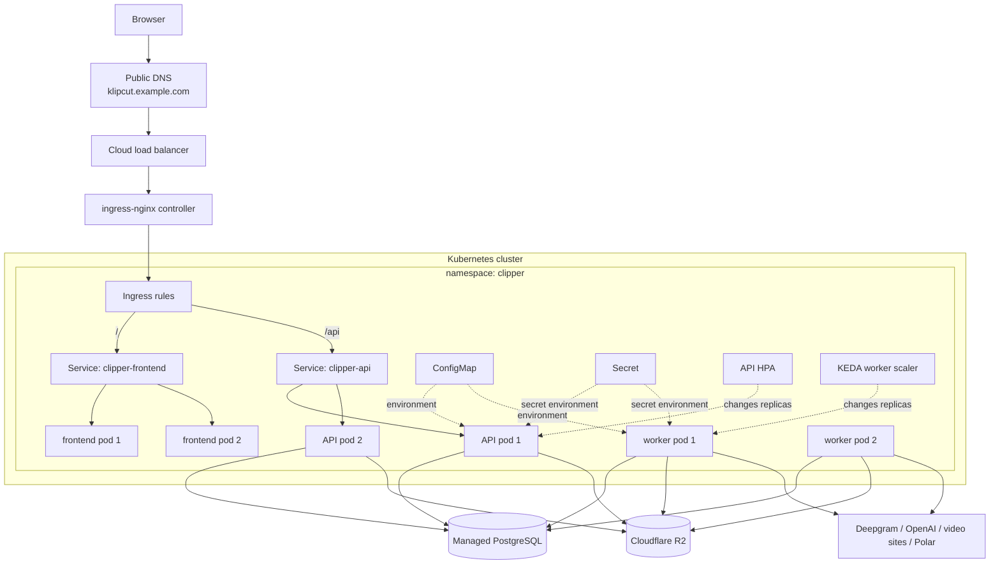
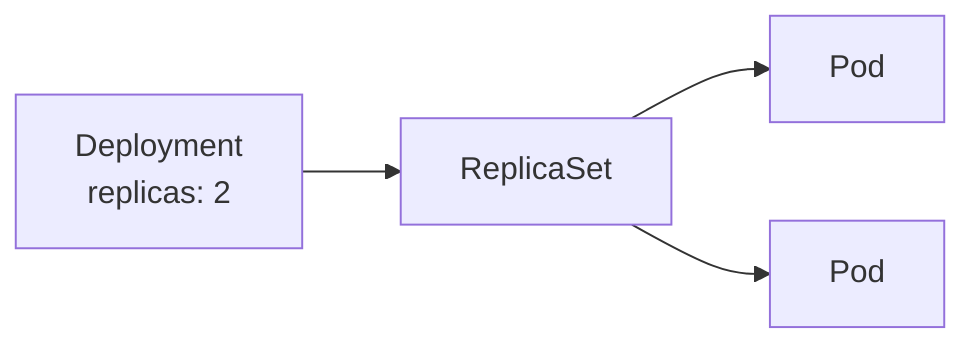
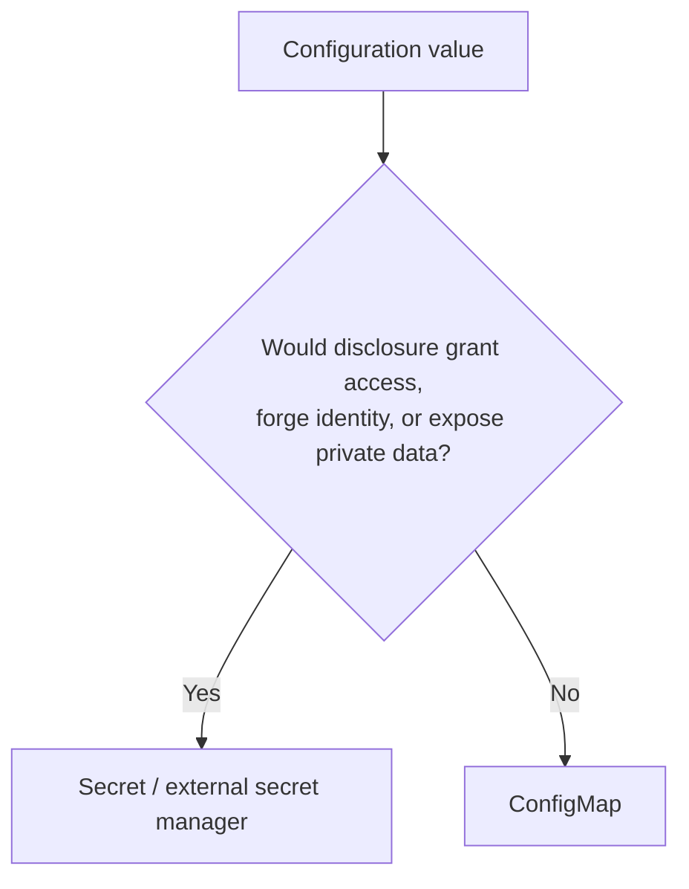
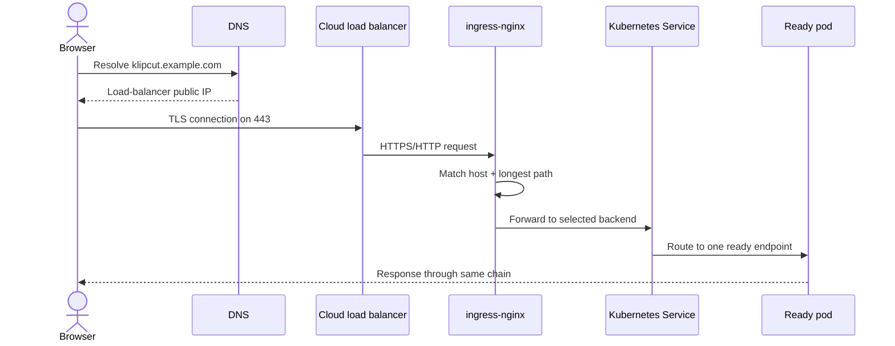
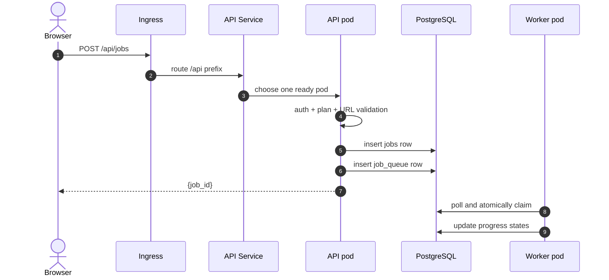
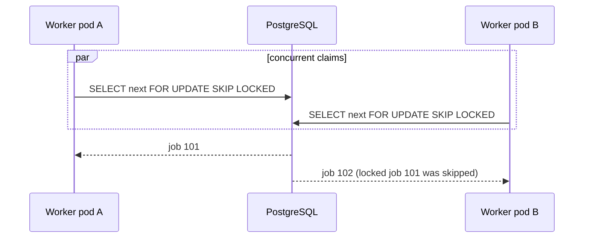
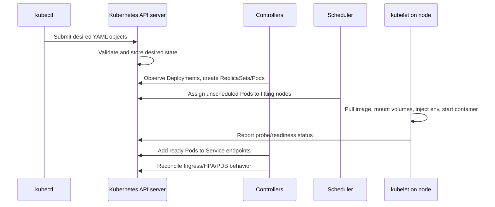
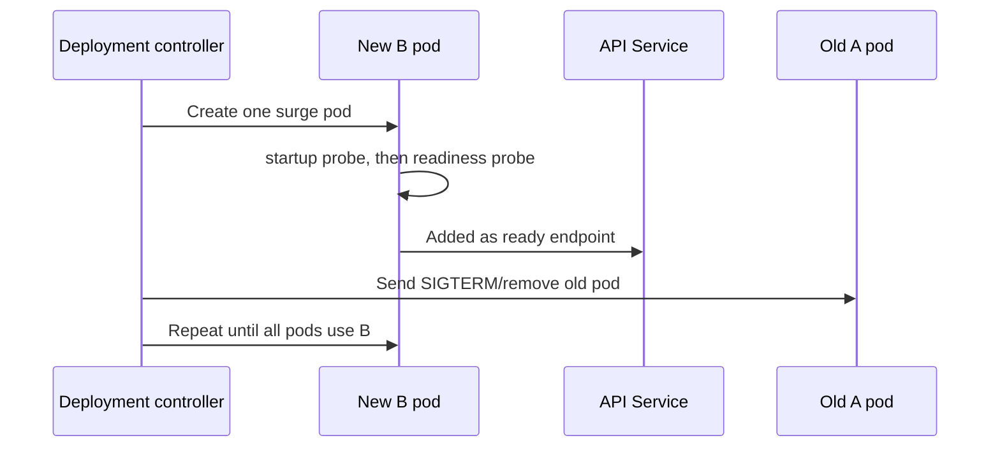

# KlipCut on Kubernetes: a detailed, end-to-end walkthrough

This document explains Kubernetes through the KlipCut application you already
understand. It answers two different questions:

1. **What happens internally when KlipCut scales?**
2. **What Kubernetes objects and files would represent that system?**

The accompanying learning manifests are in
[`deploy/kubernetes-learning/`](../deploy/kubernetes-learning/README.md). They
are separated into the same files a real repository would normally keep.

The broader database-queue-to-Kafka evolution is in
[`SCALING_KUBERNETES_KAFKA.md`](SCALING_KUBERNETES_KAFKA.md). This document
goes deeper specifically on Kubernetes.

---

## 1. The final picture first

For learning, the example puts frontend, API, and worker in Kubernetes while
keeping stateful managed services outside it:



In a cost-optimized production setup, the React frontend would normally be on
a static CDN/Vercel rather than in the cluster. It is included in the example
so that `/` versus `/api` Ingress routing is visible.

PostgreSQL and R2 should remain outside the cluster:

- PostgreSQL needs backups, replication, upgrades and durable disks. A managed
  database handles these better than a first self-hosted StatefulSet.
- R2 is already the durable shared media layer. Kubernetes volumes are not a
  better place for downloadable video.
- The cluster can then be deleted and rebuilt without deleting user data.

---

## 2. Kubernetes vocabulary, mapped to this app

### Cluster

A cluster is the complete Kubernetes environment. It has a control plane and
one or more worker machines called nodes.

### Control plane

The control plane stores the desired cluster state and runs controllers. When
you apply `replicas: 2`, you are not manually starting two processes. You are
recording a desired state. Controllers continually compare desired and actual
state and create or replace resources until they match.

That continuous correction is called **reconciliation**.

### Node

A node is a VM or physical machine with CPU, memory and disk. Kubernetes
schedules pods onto nodes. KlipCut benefits from at least two kinds of node
capacity:

- smaller/general nodes for frontend and API pods;
- compute nodes with enough CPU, memory and ephemeral disk for FFmpeg workers.

Later, separate node pools and taints/tolerations can ensure video workers do
not crowd API pods off a node.

### Pod

A pod is the smallest scheduled unit. Usually one KlipCut pod contains one
container:

```text
API pod      → one uvicorn container
worker pod   → one python worker.py container
frontend pod → one Nginx container serving built React files
```

Pods are disposable. Their names and IPs change when they are replaced. Never
put a pod IP in frontend code and never treat pod disk as durable storage.

### Deployment and ReplicaSet

A Deployment says how a stateless pod should run and how many replicas should
exist. It creates ReplicaSets, which create pods.



Changing the image creates a new ReplicaSet. During a rolling update, new pods
become ready before old pods are removed according to `maxSurge` and
`maxUnavailable`.

### Labels and selectors

Labels are key/value identity tags. A Service or Deployment selector finds
pods by label, not by pod name:

```yaml
selector:
  app.kubernetes.io/name: clipper-api
```

If labels and selectors do not match exactly, the Service has no endpoints and
traffic returns 502/503 even though the pods may look healthy.

### Service

A Service gives changing pods one stable virtual IP and DNS name. The API
Service selects all ready API pods:

```text
clipper-api.clipper.svc.cluster.local
             │
             ├── API pod 10.2.1.7:8000
             └── API pod 10.2.3.9:8000
```

Inside the `clipper` namespace, callers can simply use `http://clipper-api`.
The Service sends each connection to one ready endpoint. It does not start
pods, store requests, or provide application retries.

The worker has no Service because nothing sends inbound network requests to a
worker. It initiates outbound connections to PostgreSQL, R2 and providers.

### Ingress and Ingress controller

An Ingress is a set of HTTP routing rules. It is only configuration. An
Ingress **controller** such as ingress-nginx watches those rules and configures
the real reverse proxy/load balancer. Creating an Ingress without installing a
controller exposes nothing.

Kubernetes notes that the Ingress API is stable but frozen and recommends the
newer Gateway API for new capabilities. Ingress remains widely used and is
appropriate for this learning design. See the official
[Ingress concept](https://kubernetes.io/docs/concepts/services-networking/ingress/).

### ConfigMap

A ConfigMap stores non-secret configuration: flags, hostnames, limits and model
selection. The KlipCut ConfigMap is
[`01-configmap.yaml`](../deploy/kubernetes-learning/01-configmap.yaml).

Examples:

```text
CLIPPER_INLINE_WORKER=0
STORAGE_BACKEND=r2
CLIPPER_PARALLEL_RENDERS=1
CLIPPER_STALE_CLAIM_MINUTES=45
```

### Secret

A Secret stores sensitive values such as database passwords, JWT signing
material and provider credentials. The safe placeholder is
[`02-secret.example.yaml`](../deploy/kubernetes-learning/02-secret.example.yaml).

Important: a Kubernetes Secret is base64-encoded and, by default, Secret data
can be stored unencrypted in etcd. RBAC, encryption at rest and an external
secret manager are still necessary. See the official
[Secrets documentation](https://kubernetes.io/docs/concepts/configuration/secret/).

### HPA and KEDA

The HorizontalPodAutoscaler changes a Deployment replica count using metrics.
The example API HPA uses average CPU. It requires a working resource metrics
pipeline, commonly Metrics Server.

KEDA adds event/backlog scalers. For the current application, it can query the
PostgreSQL `job_queue` table and change worker replicas based on waiting work.
The [KEDA PostgreSQL scaler](https://keda.sh/docs/2.20/scalers/postgresql/)
requires a numeric query result and supports `connectionFromEnv`, `query` and
`targetQueryValue`, which the example uses.

### PDB

A PodDisruptionBudget limits **voluntary** disruptions, such as a node drain.
It does not prevent crashes, OOM kills, node loss or bad application deploys.
The API PDB keeps at least one API pod available during voluntary maintenance.

---

## 3. Why there are separate Deployments

API and rendering have different scaling signals and resource shapes.

| Property | API pod | Worker pod |
|---|---|---|
| Process | Uvicorn/FastAPI | `worker.py` + FFmpeg |
| Work duration | Usually milliseconds/seconds | Minutes |
| CPU | Low/moderate | Sustained high |
| Memory | Moderate | High and input-dependent |
| Scaling signal | HTTP rate/latency/CPU | Queue depth and oldest job age |
| Public inbound traffic | Yes, through Service/Ingress | No |
| Safe termination | Short drain | Finish job or retry after lease expires |

If they were one Deployment, a traffic spike would create extra FFmpeg
capacity unintentionally, and a render spike would create unnecessary web
servers. Worse, FFmpeg could exhaust CPU/memory and make login, polling and
billing slow.

The same backend image is still used for both. Only the command and resource
allocation differ:

```text
API:    uvicorn server:app --host 0.0.0.0 --port 8000
Worker: python worker.py
```

This is a useful container principle: build once, run the immutable artifact
in different roles.

---

## 4. What each repository file does

```text
00-namespace.yaml
```

Creates the `clipper` name boundary. Names such as `clipper-api` only need to
be unique inside it. RBAC, quotas and network policies can also be scoped by
namespace.

```text
01-configmap.yaml
```

Defines safe settings shared by API and workers. Values under `data` are
strings. Environment settings are read when Python modules start, so changing
the ConfigMap does not update already-running Python processes. Trigger a
rollout after changing it.

```text
02-secret.example.yaml
```

Documents required secret names but contains no usable credentials. A real
Secret with the name `clipper-secrets` must exist before pods can start. In a
real platform, use External Secrets, Sealed Secrets, SOPS, or the cloud's
workload identity/secret integration instead of committing plaintext.

```text
03-service-accounts.yaml
```

Gives each workload a Kubernetes identity. `automountServiceAccountToken:
false` prevents injecting an API token because these pods do not call the
Kubernetes API. Later, cloud workload identity can attach narrowly scoped R2
or secret permissions to the relevant account.

```text
10-api.yaml
```

Contains two related objects:

- `Deployment/clipper-api` manages API pods.
- `Service/clipper-api` gives them a stable network endpoint.

It starts with two replicas so one can disappear during maintenance without a
complete API outage.

```text
11-worker.yaml
```

Creates two worker pods. There is deliberately no Service. Workers poll and
claim from PostgreSQL using `SELECT ... FOR UPDATE SKIP LOCKED`, so adding a pod
adds one job-processing slot.

```text
12-frontend.yaml
```

Shows a frontend Deployment and Service. The image must contain `frontend/dist`
served by a non-root Nginx configuration on port 8080, including SPA fallback
to `index.html`. The frontend defaults to `/api`, which matches the same-host
Ingress.

```text
20-ingress.yaml
```

Routes one hostname:

```text
https://klipcut.example.com/api/... → clipper-api Service
https://klipcut.example.com/...     → clipper-frontend Service
```

`server.py` already mounts the FastAPI application at `/api`, so the path must
not be rewritten away.

```text
30-api-hpa.yaml
```

Keeps 2–10 API replicas and targets 65% average CPU utilization relative to
their CPU requests. A scale-down stabilization window avoids removing pods in
response to a brief quiet period.

```text
31-worker-keda.yaml
```

Optionally scales the worker Deployment from unclaimed eligible queue rows.
It is excluded from the default Kustomization because KEDA is a separately
installed controller/CRD.

```text
40-pdb.yaml
```

Protects minimum availability during voluntary disruptions.

```text
kustomization.yaml
```

Lists the resources that belong to this deployable unit. `kubectl apply -k`
builds and applies the set together. Later, Kustomize overlays can hold staging
and production differences without duplicating the whole YAML.

---

## 5. ConfigMap versus Secret in detail

Use this decision:



### KlipCut value classification

| Value | Store in | Reason |
|---|---|---|
| `DATABASE_URL` | Secret | Contains database username/password |
| `CLIPPER_SECRET_KEY` | Secret | Can forge login tokens if exposed |
| R2 access key/secret | Secret | Grants object access |
| OpenAI/Deepgram/Polar keys | Secret | Billable account access |
| `POLAR_WEBHOOK_SECRET` | Secret | Verifies payment event authenticity |
| `R2_BUCKET`, `R2_ENDPOINT` | ConfigMap | Resource identity, not credential |
| `STORAGE_BACKEND=r2` | ConfigMap | Behavior flag |
| model IDs | ConfigMap | Deployment choice |
| concurrency/timeout values | ConfigMap | Operational tuning |
| allowed public origin | ConfigMap | Public hostname |

### How values reach the process

Both backend Deployments contain:

```yaml
envFrom:
  - configMapRef:
      name: clipper-config
  - secretRef:
      name: clipper-secrets
```

At pod creation, Kubernetes constructs environment variables for the
container. Python reads them through `os.environ`. Because environment
variables do not change inside an existing process, restart pods after a
configuration or Secret rotation:

```bash
kubectl -n clipper rollout restart deployment/clipper-api
kubectl -n clipper rollout restart deployment/clipper-worker
```

### What must never happen

- Do not commit a populated Secret YAML.
- Do not bake `.env` into the container image.
- Do not print full environment dumps in logs.
- Do not place credentials in ConfigMaps.
- Do not put secrets in frontend `VITE_*` variables. Vite embeds them into
  browser JavaScript at build time, making them public.
- Do not assume base64 is encryption.

---

## 6. Ingress, DNS and TLS in detail

### The components



### DNS

After the Ingress controller obtains a public load-balancer address, create a
DNS `A`/`AAAA` or `CNAME` record for `klipcut.example.com`. Tools such as
ExternalDNS can automate this, but DNS is not created by the Ingress resource
unless such a controller is installed.

### TLS

The Ingress refers to:

```yaml
tls:
  - hosts: [klipcut.example.com]
    secretName: klipcut-tls
```

That Secret contains the certificate and private key. cert-manager can request
and renew it from Let's Encrypt when the referenced ClusterIssuer exists. If
cert-manager is absent, create/provision the TLS Secret another way and remove
its annotation.

### Path routing

For `networking.k8s.io/v1` Ingress with `pathType: Prefix`, `/api` matches
`/api/jobs` and `/api/health`. `/` matches everything else. The longer `/api`
path wins for API calls.

No sticky sessions are needed. API state lives in PostgreSQL/R2, not process
memory, so any request can reach any ready API pod.

### Large uploads and long requests

The current application allows up to 4 GiB uploads and still performs editor
export/rerender synchronously. ingress-nginx defaults are normally too small
or too short, so the learning Ingress configures:

```yaml
nginx.ingress.kubernetes.io/proxy-body-size: "4g"
nginx.ingress.kubernetes.io/proxy-request-buffering: "off"
nginx.ingress.kubernetes.io/proxy-read-timeout: "1800"
nginx.ingress.kubernetes.io/proxy-send-timeout: "1800"
```

These annotations are controller-specific and string-valued; the official
[ingress-nginx annotation documentation](https://kubernetes.github.io/ingress-nginx/user-guide/nginx-configuration/annotations/)
documents the body-size and timeout behavior.

This is only a bridge. The scalable design is:

```text
1. Browser asks API for a presigned multipart upload.
2. Browser uploads chunks directly to R2.
3. Browser tells API the completed object key.
4. API verifies ownership/size/type and queues the job.
```

Then multi-gigabyte bytes do not pass through Ingress or occupy an API pod.
Editor exports should likewise return `202` and run on workers, allowing normal
short HTTP timeouts.

---

## 7. Every important application flow inside the cluster

### Flow A — loading the React application

1. Browser resolves the public hostname.
2. Ingress matches `/` and forwards to `Service/clipper-frontend`.
3. The Service chooses either ready frontend pod.
4. Nginx returns `index.html` and hashed assets.
5. React starts and uses `/api` as `API_BASE`.

### Flow B — submitting a URL job



The request finishes after queueing. The Ingress connection is not held for
the multi-minute pipeline.

### Flow C — two workers try to claim simultaneously



This is why several workers do not normally render the same queue row. The
claim includes worker identity, timestamp and attempt count.

### Flow D — worker pipeline

1. Worker reconstructs frozen options from the job row.
2. For an uploaded source, it downloads `job_id/source.mp4` from R2 to its own
   `emptyDir` scratch volume.
3. For a URL, it downloads/transcribes/analyzes using external providers.
4. It updates progress in PostgreSQL; browser polling sees those changes
   through any API pod.
5. FFmpeg reads/writes only local scratch files for performance.
6. Output is validated and published to deterministic R2 keys.
7. PostgreSQL is updated to `done` only after publication.
8. The queue row is deleted.
9. Pod scratch may be reclaimed at any time; it is no longer authoritative.

### Flow E — status polling

Each `GET /api/jobs/{id}` can land on a different API pod. That is safe because
all pods read the same PostgreSQL rows. While queued, the API also calculates
how many eligible jobs are ahead.

For high polling volume, evolve toward Server-Sent Events/WebSockets or slower
adaptive polling, but do not add that complexity before measuring database and
HTTP load.

### Flow F — clip download

1. Browser asks `/api/clips/{job}/{file}`.
2. API verifies the object exists/authorization rules.
3. API returns a short-lived signed R2 URL.
4. Browser streams directly from R2, including HTTP Range requests for seeking.

The cluster does not pay the CPU/network cost of proxying every video byte.

### Flow G — editor export today

The current export/rerender endpoints still run FFmpeg in the API request. In
Kubernetes this creates three problems:

- Ingress must keep a long connection alive.
- API CPU/memory becomes unpredictable.
- HPA scaling API traffic may accidentally multiply rendering capacity.

Before calling the architecture production-ready, create a durable export work
table/queue, return `202 Accepted`, and process exports in worker pods.

---

## 8. Storage inside and outside pods

### `emptyDir` scratch volume

The worker manifest mounts an `emptyDir` at `/app/storage`. It is created with
the pod and deleted with the pod. It survives a container restart inside the
same pod, but not pod replacement.

That is correct for:

- current source download
- extracted audio
- subtitle files
- FFmpeg temporary files
- files awaiting R2 publication

It is wrong for the only copy of a source or completed clip.

### Ephemeral storage requests and limits

Kubernetes schedules based partly on `ephemeral-storage` requests and can evict
pods that exceed available node disk or their limits. Estimate worst case:

```text
source
+ temporary download copy/part
+ extracted audio
+ N simultaneous output clips
+ preview proxies
+ FFmpeg temporary overhead
+ safety margin
```

The example values are starting guesses, not measured truths. Record actual
peak use for free, Creator and Pro limits, then size requests/limits from p95
and worst-case inputs.

### Why not a shared PersistentVolume?

A ReadWriteMany volume would couple workers to one filesystem, add throughput
contention, and still make public delivery/CDN behavior harder. R2 already
provides durable shared object identity and direct delivery. Keep local disk as
fast scratch and R2 as the system of record for media.

---

## 9. CPU, memory and scheduling

Kubernetes distinguishes **requests** and **limits**. Official resource
management behavior is described in
[Resource Management for Pods and Containers](https://kubernetes.io/docs/concepts/resource-management/).

- Request: what the scheduler reserves and what HPA CPU utilization uses as
  its denominator.
- CPU limit: maximum CPU time; exceeding it throttles the container.
- Memory limit: exceeding it normally causes an OOM kill.
- Ephemeral-storage limit: exceeding it can cause eviction.

Example worker:

```yaml
requests:
  cpu: "2"
  memory: 2Gi
  ephemeral-storage: 6Gi
limits:
  cpu: "2"
  memory: 3Gi
  ephemeral-storage: 12Gi
```

One worker pod runs one application job because one FFmpeg job can saturate its
CPU allocation. The application may render several clips within that job using
`CLIPPER_PARALLEL_RENDERS`; the example sets it to `1` until load tests prove
parallel FFmpeg fits the memory/CPU budget.

If worker pods remain Pending, inspect scheduling events. Common causes are no
node with 2 free CPUs, insufficient ephemeral storage, or a node-pool taint the
pod does not tolerate.

---

## 10. Probes: startup, liveness and readiness

These answer different questions:

| Probe | Question | Failure action |
|---|---|---|
| Startup | Has the process finished starting? | Keep other probes disabled; restart after threshold |
| Liveness | Is this process stuck/dead? | Restart container |
| Readiness | Should this pod receive traffic now? | Remove it from Service endpoints |

Kubernetes' official [probe documentation](https://kubernetes.io/docs/concepts/workloads/pods/probes/)
notes that when a startup probe exists, liveness/readiness do not run until it
succeeds.

The current paths are imperfect:

- `/healthz` on `server.py` is a good process-level starting point.
- `/api/health` queries queue state and reports storage configuration, but its
  JSON can contain `"ok": false` while still returning HTTP 200. Kubernetes
  only evaluates the HTTP status.

Add a dedicated `/readyz` that returns non-2xx when the pod cannot serve real
requests. Keep liveness independent of PostgreSQL/R2: restarting every pod
during a shared dependency outage causes a restart storm and does not repair
the dependency.

Workers currently expose no HTTP port. Their health is better represented by
job lease heartbeats and metrics than by “Python process exists.” A live but
wedged worker must eventually lose its lease.

---

## 11. Autoscaling in detail

### API HPA calculation

With a 250m CPU request and 65% target, a pod using about 162.5m CPU is at its
target. HPA compares the average across ready pods and adjusts desired
replicas. It does not directly understand p95 latency or database saturation.

CPU is a starting signal. Production API scaling often also uses request rate
or latency through a custom metrics adapter.

### Worker scaling from queue depth

The optional KEDA object runs:

```sql
SELECT count(*)
FROM job_queue
WHERE claimed_at IS NULL
  AND available_at <= now();
```

With `targetQueryValue: "2"`, the intent is roughly one worker replica for
every two waiting jobs, capped at 20. This is not a complete capacity model.
Also watch the oldest waiting age and average job duration.

```text
worker service rate = 1 / average job duration
minimum workers ≈ arrival rate / worker service rate
```

If a worker finishes one job every 4 minutes, it serves 0.25 jobs/minute. A
sustained arrival rate of 1 job/minute needs 4 workers just to stop backlog
growth; 5–6 gives headroom.

### Why scaling down is slow

KlipCut jobs last minutes. A 600-second cooldown/stabilization window avoids
thrashing. `worker.py` catches SIGTERM, stops claiming new jobs and tries to
finish its current one. Kubernetes waits up to
`terminationGracePeriodSeconds: 1800` before forcing termination.

If the pod is killed, the claim remains until stale recovery. The current claim
uses the initial `claimed_at`, not a heartbeat. A legitimate job longer than 45
minutes can therefore look dead and be duplicated. Add renewable leases before
allowing job times near the stale threshold.

### Provider and budget caps

Even if 100 jobs wait, scaling to 100 workers may exceed:

- Deepgram/OpenAI concurrency or rate limits;
- database connection capacity;
- cloud CPU quota;
- R2 request limits;
- your acceptable cost per minute.

`maxReplicaCount` is a safety and budget control, not only a technical limit.

---

## 12. What happens during `kubectl apply`

When you run:

```bash
kubectl apply -k deploy/kubernetes-learning
```

the simplified chain is:



`apply` returning success does not mean the application is ready. It means the
objects were accepted. Watch rollout and events:

```bash
kubectl -n clipper rollout status deployment/clipper-api
kubectl -n clipper get pods -w
kubectl -n clipper get events --sort-by=.lastTimestamp
```

---

## 13. Rolling deployments in detail

Suppose API image version A has two ready pods and you change to image B:



`maxUnavailable: 0` protects capacity, but only if readiness is honest.

Worker rollouts are harder because work is long-running. New workers can start
claiming while old workers finish. Ensure:

- job payloads have a schema/pipeline version;
- old and new releases can coexist during the rollout;
- SIGTERM handling stops new claims;
- grace period covers normal work;
- claims are retryable and side effects idempotent.

Database schema migrations must be backward compatible with both versions:

1. expand schema (add nullable/new structures);
2. deploy code that understands old and new;
3. backfill;
4. switch reads/writes;
5. contract old schema in a later release.

Do not rely on `create_all()` for this. Introduce Alembic and run one migration
Job per release.

---

## 14. Failure walkthroughs

### API pod crash

The Service stops routing to it after readiness disappears. Another API pod
handles later polling. The queued job remains in PostgreSQL. A browser request
that was exactly in flight may fail and should be retried safely.

### Worker OOM kill

The container exits immediately and cannot release its claim. The Deployment
creates a replacement. After the stale lease window, a worker releases/retries
the claim. Billing and R2 writes must be idempotent because part of the old run
may already have succeeded.

### Node loss

All pods on the node disappear. Deployments recreate them on healthy nodes.
`emptyDir` data on the lost node is gone; PostgreSQL/R2 state remains.

### PostgreSQL outage

APIs cannot create/read jobs and workers cannot claim/update. Workers should
back off. Readiness should remove API pods from traffic if they cannot serve
meaningful requests, but liveness should not restart them repeatedly.

### R2 outage

Rendering may finish locally, but the worker must not mark `done` until publish
succeeds. Retry publication while scratch exists or rerun idempotently.

### Ingress controller failure

The application pods can be healthy but public routing fails. Run multiple
controller replicas and let the cloud load balancer target ready controllers.

### Bad Secret

The pod may fail during import/startup or later provider calls. `kubectl
describe pod` shows start failures; application logs show configuration errors.
Roll back/rotate the Secret and restart the Deployments.

### Routine API scale-up—the current hidden bug

`app.main::_recover_orphaned_jobs()` runs on every API startup and marks all
active states failed. In a multi-pod cluster, starting a new API pod can mark a
job owned by a healthy worker as failed. Disable this recovery when
`CLIPPER_INLINE_WORKER=0`; use worker leases/reconciliation instead.

---

## 15. Networking and security boundaries

Only the Ingress controller should be publicly reachable. Frontend and API
Services are `ClusterIP`, which means internal-only. Worker pods expose no
port.

Desired communication matrix:

| Source | Destination | Purpose |
|---|---|---|
| Ingress controller | frontend Service | Static app |
| Ingress controller | API Service | Public API |
| API pods | PostgreSQL | Users/jobs/queue/billing |
| API pods | R2 | Upload publication and signed downloads |
| API pods | Polar/video metadata providers | HTTP operations |
| Worker pods | PostgreSQL | Claims/progress/results |
| Worker pods | R2 | Sources and outputs |
| Worker pods | Deepgram/OpenAI/video sites | Pipeline |
| All pods | cluster DNS | Name resolution |

NetworkPolicies can enforce this, but policies for external FQDNs vary by CNI
and cloud. Start by documenting the matrix, then implement and test policies in
staging; a careless default-deny egress policy can block DNS or provider APIs.

Use least privilege:

- API and worker should have different database roles where practical.
- KEDA should have a PostgreSQL account that can only run the queue-count
  query, not the application's full `DATABASE_URL`.
- R2 credentials should be scoped to the one bucket/prefix and required
  operations.
- Pods do not need Kubernetes API tokens, hence `automountServiceAccountToken:
  false`.

---

## 16. Environment structure with Kustomize

The learning directory is one base. A real repository could evolve to:

```text
deploy/kubernetes/
├── base/
│   ├── api.yaml
│   ├── worker.yaml
│   ├── frontend.yaml
│   ├── services.yaml
│   └── kustomization.yaml
└── overlays/
    ├── staging/
    │   ├── configmap.yaml
    │   ├── ingress-patch.yaml
    │   └── kustomization.yaml
    └── production/
        ├── configmap.yaml
        ├── replicas-patch.yaml
        ├── ingress-patch.yaml
        └── kustomization.yaml
```

The base defines structure. Overlays change hostname, replica ceilings,
resources and environment-specific settings. Secrets remain external.

Never maintain separate copied full manifests for staging and production;
copies drift and important fixes reach only one environment.

---

## 17. Container images still needed

The manifests reference two images. Studyable build definitions are provided
in [`deploy/kubernetes-learning/images/`](../deploy/kubernetes-learning/images/);
the manifest image names/digests still need to be replaced with images pushed
to your registry.

### Backend image

Must contain:

- Python runtime and `requirements.txt` packages;
- FFmpeg and ffprobe;
- yt-dlp;
- backend source;
- fonts, logos and YuNet model assets;
- non-root user;
- writable `/app/storage` and `/tmp` mount points.

Run the same digest as API and worker.

### Frontend image

Use a multi-stage build:

1. Node stage runs `npm ci` and `npm run build`.
2. Runtime stage copies `dist/` into a non-root Nginx image.
3. Nginx listens on 8080 and falls back unknown SPA routes to `/index.html`.

Because frontend `API_BASE` defaults to `/api`, no environment-specific API
origin is required for the same-host Ingress. Any `VITE_*` value is compiled
into the public bundle and changing it requires rebuilding the image.

Pin deployed images by digest. Tags such as `latest` are mutable and make a
rollback/reproduction ambiguous.

Example builds from the repository root:

```bash
docker build -f deploy/kubernetes-learning/images/Dockerfile.backend -t klipcut-backend:dev .
docker build -f deploy/kubernetes-learning/images/Dockerfile.frontend -t klipcut-frontend:dev .
```

---

## 18. Production-readiness work in application order

Before a real Kubernetes launch:

1. Use managed PostgreSQL and verify the application URL format/TLS.
2. Use R2 on API and workers with identical bucket/account configuration.
3. Set `CLIPPER_INLINE_WORKER=0` on every API pod.
4. Disable startup orphan recovery in split-worker mode.
5. Move editor export/rerender from HTTP into durable worker work.
6. Make proxy generation durable or idempotently rebuildable.
7. Add renewable worker leases/heartbeats.
8. Make charge/refund/publish operations idempotent.
9. Add a job/payload schema version for mixed-version rollouts.
10. Replace `create_all()` deployment evolution with Alembic migrations.
11. Add `/readyz`, structured logs, Prometheus metrics and correlation IDs.
12. Move retention/reconciliation to explicit scheduled commands/CronJobs.
13. Build, scan and test immutable backend/frontend images.
14. Load-test realistic videos to size CPU, memory, scratch and replica caps.
15. Deploy fixed replica counts first; add autoscaling after metrics are known.

Kafka is not a prerequisite for any of these. The existing PostgreSQL queue is
the simpler first Kubernetes architecture.

---

## 19. A deployment and debugging runbook

### Validate locally

```bash
kubectl kustomize deploy/kubernetes-learning
kubectl apply --dry-run=client -k deploy/kubernetes-learning
```

### Create the Secret safely

Prefer a secret manager. For a temporary manual learning cluster, keep the
populated file outside the repository:

```bash
cp deploy/kubernetes-learning/02-secret.example.yaml /safe/local/path/clipper-secrets.yaml
# Edit the safe local copy, then:
kubectl apply -f /safe/local/path/clipper-secrets.yaml
```

### Deploy

```bash
kubectl apply -k deploy/kubernetes-learning
kubectl -n clipper rollout status deployment/clipper-api
kubectl -n clipper rollout status deployment/clipper-worker
kubectl -n clipper rollout status deployment/clipper-frontend
```

### Debug from outside inward

```text
1. DNS resolves hostname?
2. Ingress has an address and valid TLS?
3. Ingress rule points to the expected Service/port?
4. Service has ready endpoints?
5. Pods are Running and Ready?
6. Probes and container logs explain failures?
7. Pod can reach PostgreSQL/R2/providers?
8. Application queue/status transitions are correct?
```

Useful commands:

```bash
kubectl -n clipper get ingress,svc,endpoints,pods -o wide
kubectl -n clipper describe ingress clipper
kubectl -n clipper describe pod POD_NAME
kubectl -n clipper logs POD_NAME --previous
kubectl -n clipper get events --sort-by=.lastTimestamp
kubectl -n clipper top pods
kubectl -n clipper get hpa
kubectl -n clipper rollout history deployment/clipper-api
```

### Roll back an application image

```bash
kubectl -n clipper rollout undo deployment/clipper-api
```

Rollback does not automatically undo a database migration. This is why schema
changes must be backward compatible and separately controlled.

---

## 20. The mental model to keep

```text
Deployment = how many copies and how they roll out
Pod        = one disposable running copy
Service    = stable internal address in front of changing pods
Ingress    = public HTTP host/path rules in front of Services
ConfigMap  = non-secret runtime choices
Secret     = sensitive runtime values (still needs security controls)
emptyDir   = disposable pod scratch space
R2         = durable shared video bytes
Postgres   = durable application truth and current work queue
HPA        = scales short API work from resource/custom metrics
KEDA       = scales workers from backlog
PDB        = limits voluntary simultaneous disruption
```

For KlipCut, “scaling on Kubernetes” does not mean putting the current one-box
process into many pods. It means first making ownership explicit:

- API pods own short request handling.
- Worker pods own expensive asynchronous processing.
- PostgreSQL owns durable state and scheduling records.
- R2 owns durable media.
- Kubernetes owns placement, replacement, networking and replica counts.

Once those boundaries are true, a pod can disappear without the product losing
its memory. That is the real foundation of scaling.
